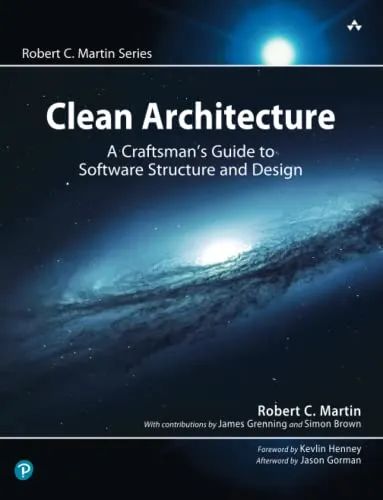
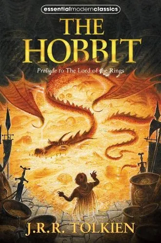

  
  

  <strong>
    hey there
    
  </strong>
  

  
You can check out my resume by scrolling down ^^. Or download a slightly modified version (Resume_en.pdf). (Don't forget to check out the recommendation letter too!)

# Zsombor Czaban

#### Otaranta 8 E 122, Espoo, 02150
#### +36 30 814 7614
#### zsombor130@gmail.com
 

---
# Workexperience 

### GE Healthcare / Software Engineer Intern (1 year)
Jun 2024 - Aug 2025, Hungary

As one of three core developers, I made a **major impact** on a Customer Onboarding Tool, taking it **from PoC** **to MVP** and then **to Milestone 1**. I worked across the **full stack** (Go backend, TypeScript frontend), enhanced internal engineering tools via **REST API integration**, and gained end-to-end **experience in enterprise software development**, from design and implementation to testing and deployment.
  

### Taboola / Algorithm Engineer (0.5 year)
Sept 2023 - Jan 2024, Budapest

At Taboola, the world’s largest discovery platform, I worked on the e-commerce **recommendation system** and developed in-house solutions for various challenges.
  

### BitKnights / Junior ServiceNow Developer (1.5 year)
Jun 2022 - Sept 2023, Hungary

I secured this job in my first year of university after an interview that came about due to a mix-up on my resume — they thought I was in my second year. I ended up **acing the interview** and was hired. I’m still **proud** of that to this day.
   

---
# Reference works

A website for organizing parites: 
https://github.com/zsomborCzaban/party_organizer
   
Solutions for the Code of Advent coding challange: 
https://github.com/zsomborCzaban/Code_of_Advent
   
A city building game, made for a university group project. (coded in Java): 
https://drive.google.com/drive/folders/1B9nnMSums4t759HmX_Zc-f7zXM9boYkg?usp=sharing
   

---
# Education

### ICT Innovation
Sept 2025 - May 2027, Finland & Greece

I’m pursuing a **dual master's degree** in **Autonomous Systems and Intelligent Robots** at Aalto University and **Marine Robotics** at the University of the Aegean through the ICT Innovation program.
  

### ELTE University
Sept 2021 - May 2025, Hungary

I completed my **BSc** in **Computer Science** at ELTE, with a semester abroad at **Åbo Akademi** University in Finland through the **Erasmus** program.
   

---
# Skills

My strong points are **logic**, **algorithms** and **enthusiasm**.

I have previous work experience with: **Go, React, Docker, Java, Python, Kubernetes, Typescript, ServiceNow**

I’m fluent in **english**, beginner in **finnish** and native in **hungarian**
   

---
# About me

I’m a curious mind who seeks a **deeper understanding** of everything I dive into.

I prefer to minimize my time on social media, **stay productive**, and play games with friends.

I enjoy **extreme sport** (skiing/snowboarding, scuba diving, skydiving, bouldering)
   

---
# Favourite Books

  
  

 

---
# Highschool awards

In 2017 I won a **national math competition** in Hungary.

Since 2018 I've been a **leader** at 121. Dr. Vetéssy Géza **scout troop**.

In 2021, I won **4th place** with 2 extra prizes at an **"innovation competition"**.

